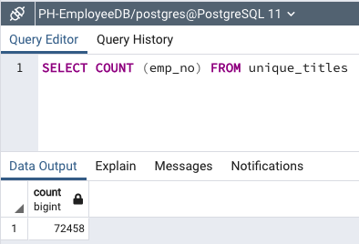
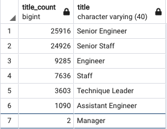
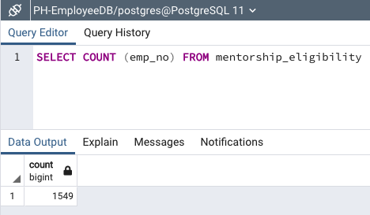

# Pewlett Hackard Analysis

## Overview
Pewlett Hackard has assigned us a challenge amidst a large number of its employees rapidly approaching retirement age--AKA the "silver tsunami". In this analysis, we are organizing the names and information of retirement-eligible employees to submit to management. They are also interested to see which employees are eligible for a mentorship program, which we will organize for them as well.

## Results

- After performing a count of employees in both the retirement_titles table and unique_titles table, it would appear that each employee held almost 2 titles during their time at Pewlett Hackard. There were 130,000+ entries before removing the duplicates with the DISTINCT ON statement, which returned 70,000+ names (see below).

- This means there will be over 72,000 current positions that will need to be filled once the "silver tsunami" passes through and these employees enter retirement.
- There were only 7 different titles held by employees at the company and only 6 that were held by more than 2 empoyees (see screenshot below).

- There are 1,549 employees that are eligible for the mentorship program (see below).

## Summary

As we have discussed above, there will be 72,458 positions to be filled once all eligible employees retire from Pewlett Hackard. However, there are only 1,549 retirement-ready employees that are eligible for the mentorship program. This is a ratio of about 50 openings/new employees to 1 eligible mentor. This will not be enough to mentor the next generation of Pewlett Hackard employees as there is no way for each person to mentor this amount of new people.

There are also a couple additional insights that Pewlett Hackard could glean from the data we have available. First, since we know the salaries of each employee that is retiring, we could use a SUM function to add up what the cumulative salary for the retirees are and subtract the entry-level or replacement salaries for the new employees to take that role. The difference here would be potential savings to the company for losing tenured employees and replacing them with newer, lower-paid employees. An additional query that we could write for some further insight could be to create a table for retirees and their genders. I'm sure Pewlett Hackard would want to maintain gender diversity in the workplace and to do so, if the retirees were disproportionally male or female, they may want to know this information when hiring replacements to make sure that the workplace isn't too male-dominated, for example. To prevent this, they could make sure they are adding enough females when replacing these roles to ensure an inclusive and representative workforce.
